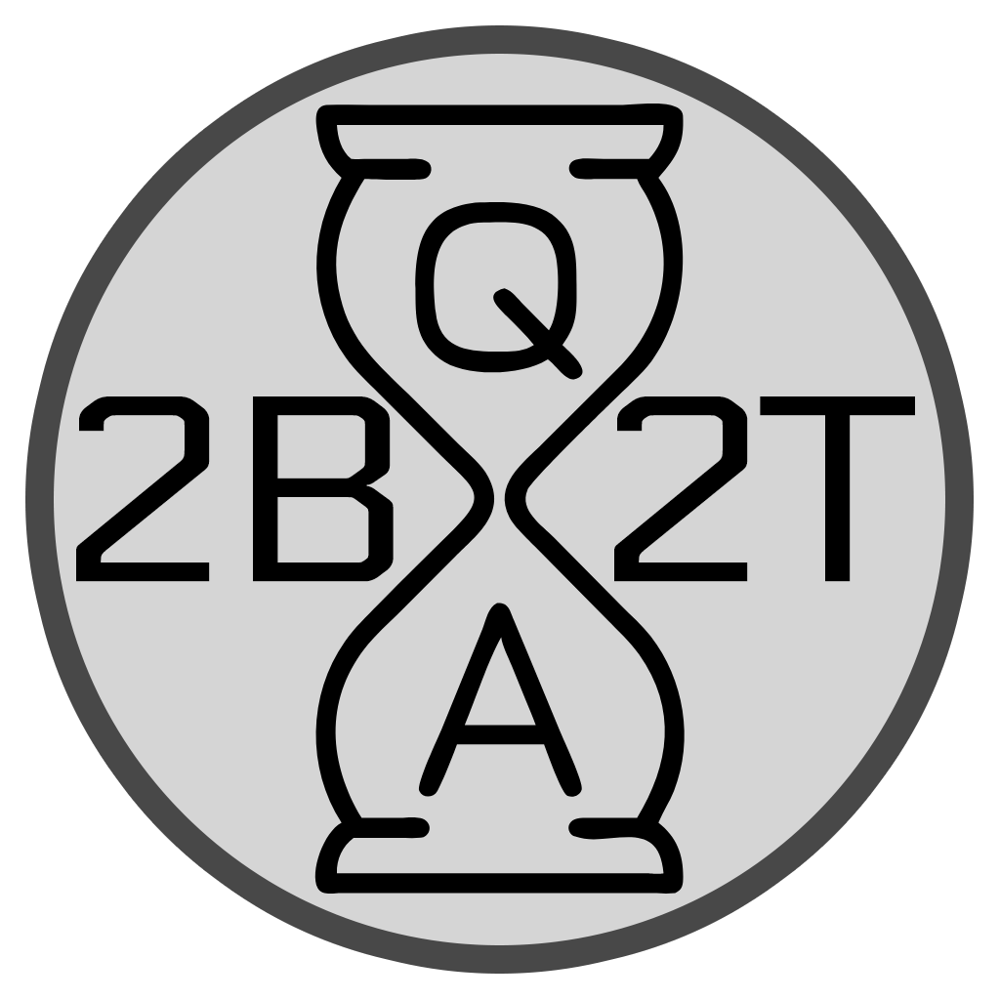
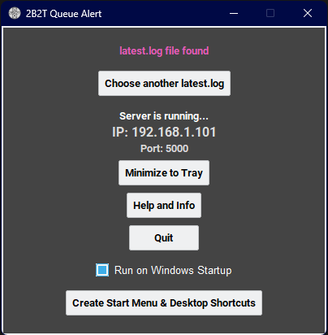
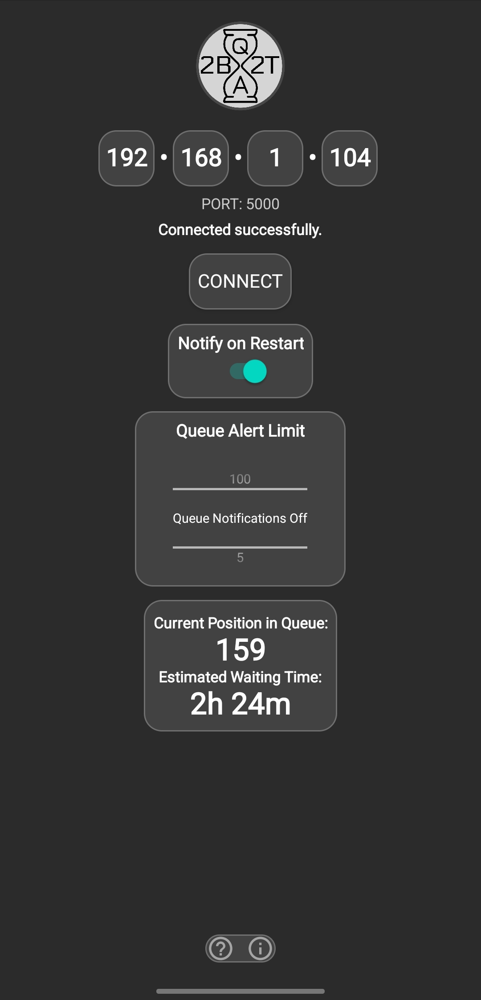
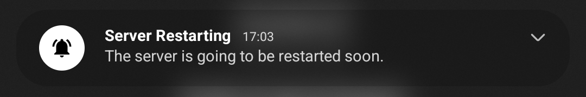
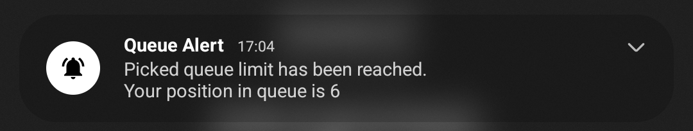

<p align="center"></p>

# About
This app tracks and notifies you of your 2B2T queue position on your Android phone.

# Usage

## Installation
To get started, download the following files:
- [PC-Server-2B2TQueueAlert.exe](https://github.com/cagritaskn/2b2t-queue-alert-android/releases/download/release/PC-Server-2B2TQueueAlert.exe) for your PC.
- [Android-Client-2B2TQueueAlert.apk](https://github.com/cagritaskn/2b2t-queue-alert-android/releases/download/release/Android-Client-2B2TQueueAlert.apk) for your Android phone.
Then install the APK file on your Android phone.

## Initialize
Make sure that your Android phone and your PC are connected to the same network connection.
To get started, first run the server **(PC-Server-2B2TQueueAlert.exe)** on your PC and enter the IP address provided by the PC server into the Android app's **(Android-Client-2B2TQueueAlert.apk)** IP address input field. Be sure to grant notification permissions for the Android app to ensure the app functions correctly.

# How does it work
The PC application reads data from Minecraft's latest.log file, uploads this data to a local IP address, and allows the Android phone, which is connected to the same network, to access and display this data. The Android phone then sends notifications based on the data received from the PC.

# Running and building the server on PC with Python
You can use the python app.py by cloning the repository to your PC, opening a terminal in the directory where the "app.py" is located (files/pc-server-python) and running the command:
```
python app.py
```

You can also build the app.py into an executable (.exe) file by cloning the repository to your PC, opening a terminal in the directory where the "app.py" is located (files/pc-server-python) and running the command:
```
pyinstaller --onefile --windowed --add-data "icon.ico;." --icon "icon.ico" app.py
```
# Building the Android app yourself
You can build the Android app yourself by cloning the repository to your PC and copying the project folder (files/android-client-project) into the projects folder of Android Studio IDE then building it from there.

# Contact
If you face any issues or errors you can contact me at:
Discord: "kegrisko." (The ID has a dot at the end)

# Screenshots from the PC server and Android app









# Dupe
The cactus dupe is still working.
